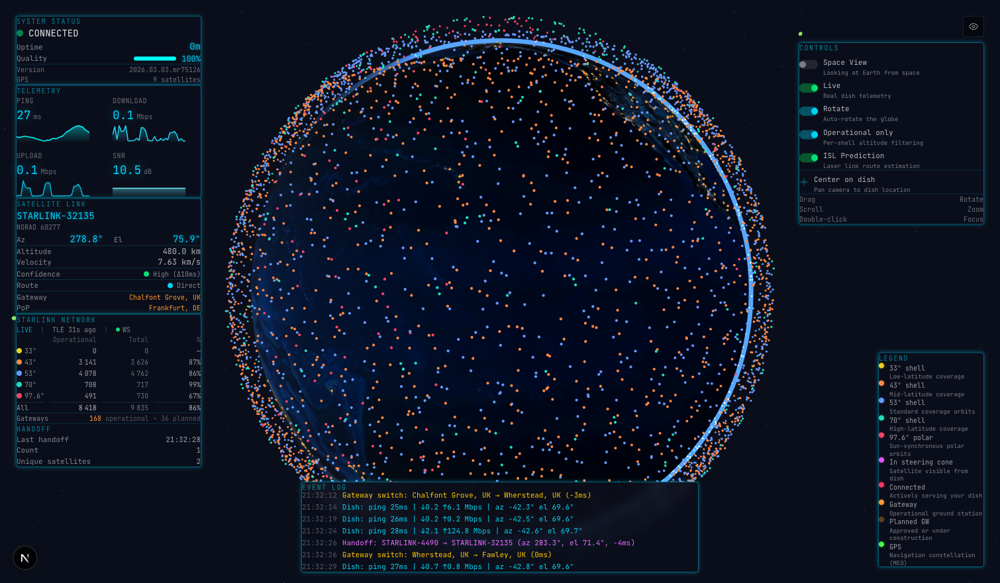
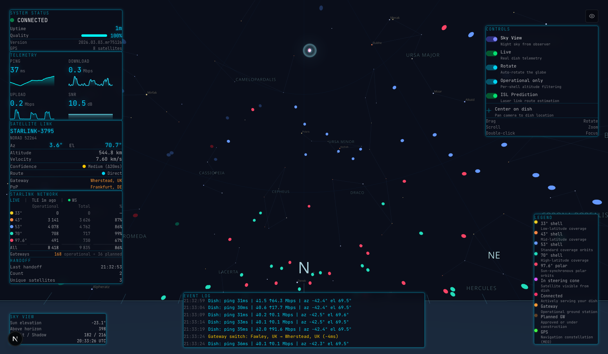

# starlink-viz

> **[GitHub Repository](https://github.com/juliensimon/starlink-viz)** | **[Technical Documentation](https://github.com/juliensimon/starlink-viz/blob/master/docs/TECHNICAL_REVIEW.md)** | **[User Guide](https://github.com/juliensimon/starlink-viz/blob/master/docs/USER_GUIDE.md)**
>
> This Space runs in demo mode with simulated dish telemetry. Connect a real Starlink dish by running locally — see the [User Guide](https://github.com/juliensimon/starlink-viz/blob/master/docs/USER_GUIDE.md) for setup instructions.

Real-time 3D Starlink satellite tracker and mission control dashboard. Track every satellite in the SpaceX Starlink constellation, monitor live dish telemetry, visualize ground stations, watch satellite handoffs, and predict inter-satellite laser link (ISL) routing — all computed from publicly available data. Includes a Stellarium-style night sky view with constellations and sun illumination modeling. Built with Next.js, React Three Fiber, and Three.js.


### Space View


### Sky View


## What it does

### Space View (looking at Earth from space)

- **~10,000 Starlink satellites** propagated in real time using SGP4 orbital mechanics across 5 orbital shells
- **GPS constellation** tracked alongside Starlink with hover identification
- **Live dish telemetry** from a real Starlink dish via gRPC (or demo mode with simulated data)
- **Astronomically accurate Sun and Moon** with real-time positioning, lens flare, and natural lunar phases
- **Satellite handoff tracking** — monitors when your dish switches between satellites
- **204 ground stations** from FCC/international filings, with operational/planned status
- **ISL routing prediction** — models inter-satellite laser links with PoP-constrained gateway selection, line-of-sight checks, and per-gateway backhaul estimation
- **Connection beam** visualization from dish to connected satellite (cyan uplink, green ISL hops, orange downlink)
- **Demo locations** — 5 remote locations (Iceland Gap, Atlantic, Gulf of Mexico, Celtic Sea) where ISL routing is mandatory
- **Day/night globe** with city lights on the dark side and atmospheric glow

### Sky View (Stellarium-style night sky from observer)

- **Horizon camera** — 360-degree panoramic view from your dish location, drag from horizon to zenith
- **~500 reference stars** with magnitude-based sizing, B-V color tinting, and named labels for the brightest
- **88 IAU constellations** with stick-figure lines and labeled names
- **Sun illumination model** — cylindrical Earth shadow dims satellites in shadow to 10% brightness; sun-aware sky gradient transitions through day/twilight/night phases
- **Satellite trajectory on hover** — shows past (cyan) and future (yellow) orbital path arcs on the dome
- **Tooltips** on satellites (name, NORAD ID, az/el, shell, sunlit status) and stars (name, magnitude)
- **Glow halo** on the connected satellite, follows handovers in real time
- **Sky HUD** — sun elevation, satellite counts (sunlit/shadow), UTC time, daytime visibility warning
- **Cardinal compass** with tick marks every 10 degrees, bold at N/S/E/W

## Quick start

```bash
npm install
npm run dev
```

Opens at [http://localhost:3000](http://localhost:3000). If no Starlink dish is detected on the network, **demo mode** activates automatically with simulated telemetry.

## Connecting to a Starlink dish

The server connects to a Starlink dish via gRPC at `192.168.100.1:9200` (the standard Starlink router address). You must be on the Starlink network.

```bash
# Custom dish address
DISH_ADDRESS=192.168.100.1:9200 npm run dev

# Force demo mode (no dish required)
DEMO_MODE=true npm run dev

# Custom dish location (defaults to 48.910°N, 1.910°E)
NEXT_PUBLIC_DISH_LAT=37.7749 NEXT_PUBLIC_DISH_LON=-122.4194 npm run dev
```

## Architecture

```
server.ts                    Custom HTTP + WebSocket + Next.js server
├── gRPC client              Polls dish status (1s) and history (5s)
├── WebSocket server         Broadcasts telemetry to all browser clients
└── Next.js app              Serves the frontend

src/
├── components/
│   ├── scene/               3D scene (React Three Fiber)
│   │   ├── Globe            Earth with day/night textures
│   │   ├── SatellitePropagator  Headless SGP4 propagation (shared by both views)
│   │   ├── Satellites       Space view instanced mesh renderer
│   │   ├── SkyView          Sky view root (groups all sky components)
│   │   ├── sky/             Sky view components
│   │   │   ├── SkyDomeCamera     Stellarium-style horizon camera + OrbitControls
│   │   │   ├── SkyEnvironment    Ground plane, sky gradient, horizon ring, compass
│   │   │   ├── SkyGrid           Elevation circles, azimuth lines, cardinal labels
│   │   │   ├── SkyConstellations 88 IAU constellation lines + labels
│   │   │   ├── SkySatellites     Az/el dome projection with sun shadow coloring
│   │   │   ├── SkyStars          ~500 reference stars with RA/Dec→Az/El transform
│   │   │   ├── SkyBeam           Glow halo on connected satellite
│   │   │   ├── SkyTooltip        Hover tooltips for satellites + stars
│   │   │   └── SkyTrajectory     ±5min trajectory arc on hover
│   │   ├── GpsSatellites    GPS constellation overlay
│   │   ├── Sun              Directional light + glow + lens flare
│   │   ├── Moon             Textured sphere with Fresnel halo
│   │   ├── Atmosphere       Fresnel glow shader
│   │   ├── GroundStations   Gateway markers (star-shaped, operational/planned)
│   │   ├── ConnectionBeam   Dish-to-satellite-to-gateway beams (always mounted)
│   │   ├── DishMarker       Your dish location
│   │   └── SceneSetup       Camera, controls, starfield
│   └── hud/                 Overlay panels
│       ├── StatusBar        Connection state, uptime, quality
│       ├── TelemetryPanel   Ping, throughput, SNR charts
│       ├── SatelliteInfoPanel  Satellite link, gateway, PoP, confidence
│       ├── HandoffPanel     Starlink Network stats, shell info, handoffs
│       ├── SkyHud           Sky view stats (sun elevation, sat counts, UTC)
│       ├── EventLog         Real-time event feed
│       └── ViewControls     Space/Sky toggle, auto-rotate, altitude filter
├── data/                    Embedded datasets
│   ├── bright-stars.ts      ~500 stars (mag ≤ 4.0) with J2000 RA/Dec
│   └── constellations.ts    88 IAU constellation stick figures
├── stores/                  Zustand state (app + telemetry)
├── hooks/                   useSatellites, useHandoff
└── lib/
    ├── grpc/                Dish protocol, mock data
    ├── satellites/          TLE fetching, SGP4 propagation, satellite store
    ├── websocket/           Client + server + protocol
    └── utils/               Coordinates, astronomy, observer frame, sun shadow,
                             star coordinates, shell colors, formatting
```

## Commands

| Command | Description |
|---------|-------------|
| `npm run dev` | Start dev server (HTTP + WebSocket + Next.js) |
| `npm run dev:next` | Start Next.js only (no backend polling) |
| `npm run build` | Production build |
| `npm run start` | Start production server |
| `npm run test` | Run tests (vitest) |
| `npm run update-gs` | Update ground station data |

## Tech stack

- **[Next.js 16](https://nextjs.org/)** — App router, API routes, SSR
- **[React Three Fiber](https://r3f.docs.pmnd.rs/)** — React renderer for Three.js
- **[drei](https://drei.docs.pmnd.rs/)** — R3F helpers (OrbitControls, Billboard, Text, Stars)
- **[satellite.js](https://github.com/shashwatak/satellite-js)** — SGP4/SDP4 orbital propagation + GMST
- **[Zustand](https://zustand.docs.pmnd.rs/)** — Lightweight state management
- **[gRPC](https://grpc.io/)** — Dish communication protocol
- **[Tailwind CSS 4](https://tailwindcss.com/)** — Styling

## How it works

**Satellite propagation**: TLE (Two-Line Element) data is fetched from CelesTrak. A headless `SatellitePropagator` component computes each satellite's position every animation frame using SGP4, writing into a shared `Float32Array`. Both Space and Sky views read from this shared buffer — propagation happens once regardless of which view is active.

**Sky view**: Satellite positions are projected from geocentric 3D coordinates to the observer's local horizontal frame (azimuth/elevation) using an ENU (East-North-Up) reference frame constructed from the dish latitude/longitude. Each satellite is placed on a virtual dome at its az/el position. Stars use RA/Dec→Az/El conversion via Greenwich Mean Sidereal Time. Sun illumination uses a cylindrical Earth shadow model to determine which satellites are sunlit vs. in shadow.

**Dish telemetry**: The Node.js server connects to the Starlink dish's gRPC interface, polling status and signal history. Data is broadcast over WebSocket to all connected browsers and stored in Zustand.

**Sun and Moon**: Positions are computed from real astronomical algorithms — the Sun from ecliptic longitude and Earth's axial tilt, the Moon from mean orbital elements with perturbation corrections. The directional light follows the Sun, so the globe's day/night side and the Moon's phase are both physically accurate.

## Data sources and accuracy

This project aims to be as accurate as possible using exclusively public data. No proprietary SpaceX systems, internal APIs, or classified constellation parameters were used.

| Source | What it provides |
|--------|-----------------|
| [CelesTrak / NORAD](https://celestrak.org/NORAD/elements/gp.php?GROUP=starlink&FORMAT=tle) | TLE orbital parameters for every tracked Starlink & GPS satellite |
| [Starlink dish gRPC API](https://github.com/sparky8512/starlink-grpc-tools) | Real-time telemetry from your own dish (signal, throughput, antenna orientation) |
| [FCC / ITU filings](https://fcc.report) | Ground station locations, cross-referenced with community research |
| [Hipparcos / Yale BSC](https://heasarc.gsfc.nasa.gov/W3Browse/star-catalog/bsc5p.html) | ~500 bright star positions (J2000 RA/Dec, magnitudes, B-V color indices) |
| [IAU constellation data](https://www.iau.org/public/themes/constellations/) | 88 constellation stick figure line definitions |
| Starlink DNS conventions | PoP code mappings (e.g., `customer.frntdeu.pop.starlinkisp.net` → Frankfurt) |
| System traceroute / DNS | Network path analysis — which internet exit point your traffic uses |

**What this app does NOT have access to**: SpaceX's internal satellite scheduling, inter-satellite laser link routing, per-satellite capacity/load, precise orbital data used by the dish (more accurate than public TLEs), or satellite maneuver/deorbit status.

Everything beyond public data and live dish readings is an approximation or educated guess. For a full breakdown of what's measured vs. inferred, see the [Technical Review](docs/TECHNICAL_REVIEW.md).

## Documentation

- **[User Guide](docs/USER_GUIDE.md)** — Setup, configuration, UI walkthrough, and feature reference
- **[Technical Review](docs/TECHNICAL_REVIEW.md)** — Data sources, accuracy analysis, and what's measured vs. approximated

## License

MIT
